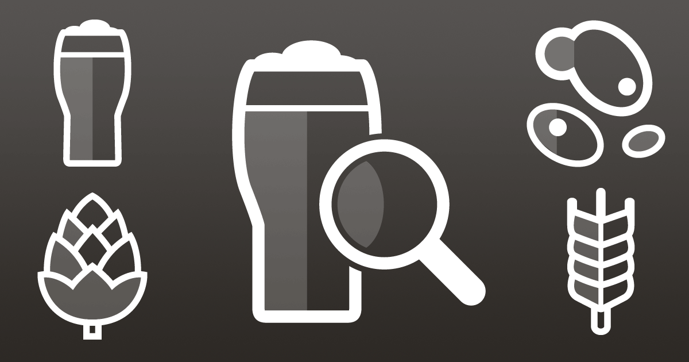
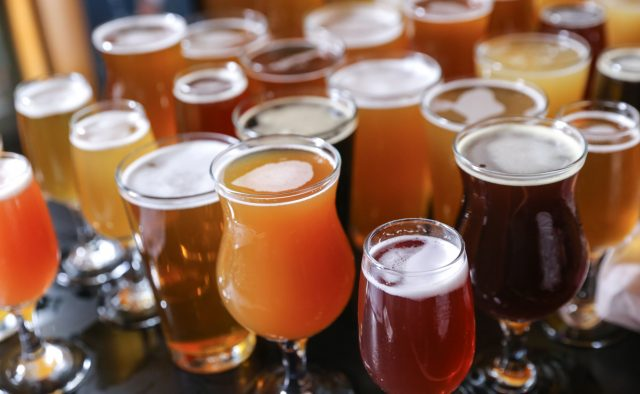
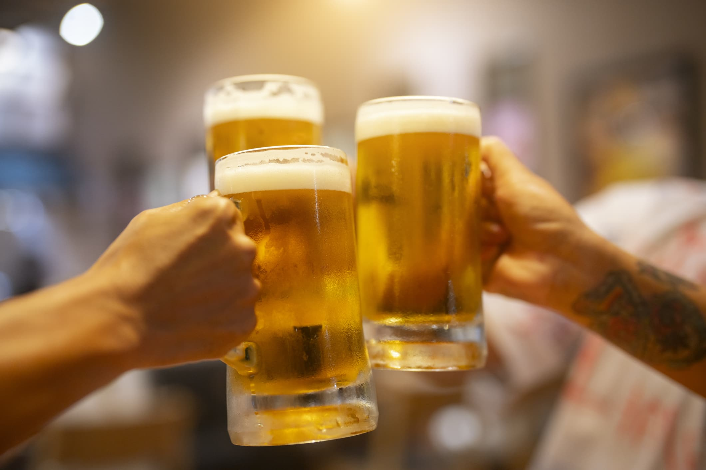
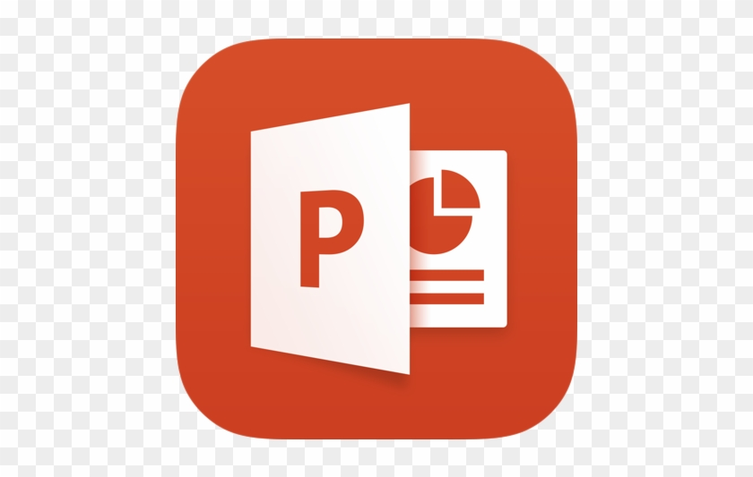

# Beer Recommender

  

# Overview
# Purpose - Background & Topic Selection Reasoning
Craft beer is becoming increasing demanded by consumers in today’s market. Consumers’ willingness to spend more on craft beer based on variety, flavor and quality has increased since its beginnings in the 1960s. Craft beer is typically made with higher quality ingredients, which provides consumers with a more flavorful and distinctive tasting beer than mass-produced options. Those reaching for a craft beer often want to try something different and new. The number of operating craft breweries in the U.S. reached an all-time high in 2021 of 9,118. We have come together as a team to help with the biggest question when it comes to craft beer, "Which one should I get?". We are developing a Beer Recommending system using [Kaggle Beer Profile and Ratings Data Set](https://www.kaggle.com/datasets/ruthgn/beer-profile-and-ratings-data-set) and a machine learning algorithm to recommend a beer just for you based on your taste preferences. 

# Questions to answer based on dataset.

  

### #1 What style of beer is most popular based on data from consumers?
### #2 Which flavor profile is most popular based on the dataset?
### #3 Which breweries have the most popular beers based on reviews?
### #4 What type of beer you might prefer based on your input of type of taste preferences?

# Answers to questions using the dataset.
[Tableau Visual Graphs](https://public.tableau.com/app/profile/tim6081/viz/Final_Project_16681028326290/Most_popular_flavor_profile?publish=yes)

### #1 Most Popular Beer

### #2 Most Popular Flavor Profile based on the dataset.

### #3 Most Popular Brewery based on the dataset.

### #4 What type of beer should I get based on our beer recommending system.

# Team Members:

  

## - Jack Moletteire
## - Timothy Malasky
## - Souleymane Ndiaye
 
# Software
•  Python

•  SQLite

•  Pandas library

•  Machine Learning Algorithm – Scikit-Learn

•  Tableau Public 

•  Powerpoint

•  HTML

•  CSS

# Resources

• [updated_beer_profile_and_ratings.csv](https://github.com/Tmalasky/Beer_Recommender/files/9914763/updated_beer_profile_and_ratings.csv)

# Rules & Expectations
- Rule # 1 Work as a team!
- Rule # 2 Use Slack and Zoom to communicate any issues or to pass along any information.
- Rule # 3 Team Participation and use of class time to work on project is required.
- Rule # 4 Team members must ask for help when stuck on an individual task.
- Rule # 5 Team members will complete tasks on time for review and approval.
- Rule # 6 Team members must inform if the task will be completed late.
- Rule # 7 Team members must inform if an emergency presents itself and responsibilities must be divided.

# Machine Learning Model

  

We are building a multi-class classification model that will analyze user preferences to determine
preferred beer style and make recommendations.

## Feature Selection
Preliminary analysis and preprocessing involved analyzing variables (e.g., ABV, min./max. IBU, taste profile, review data, etc.) and grouping related data. A SQLite
database was created to store several tables of related information such as taste data, review scores,
and names & breweries, creating a more organized source. 

After building the database, there was further discussion about the direction of the project, at which point
we decided the model would only learn from objective*, numerical data. This meant only taste profile
(e.g., Astringency, Bitterness, Saltiness, etc.) and chemical composition (ABV, min./max. IBU) would be considered
in the construction of the model, while review data and identifying information would be excluded. The choice was 
made with the belief that a model based on factual data would provide more significant output than one that considered 
more opinionated statistics such as review scores, which we believed were more volatile, and susceptible to outliers. 

_*Taste profile, while not an exact science, is based on word counts from descriptions and user reviews, 
with "the assumption that people writing reviews are more than likely describing what they do experience rather 
than what they do not. (Kaggle)" As such, we believe it is more reliable than arbitrarily assigned review scores._

## Preprocessing & Initial Construction
Data was imported from the SQLite database and stored in Pandas dataframes. Taste and chemical data (our features) were
then standardized using SciKit-Learn's MinMaxScaler. However, because taste values were calculated based on absolute word counts 
originating from user reviews of various lengths, the ranges of values for these columns varies widely, and 
inconsistently, between beers. Thus, we had to scale values across each row (beer) before applying the scaler across columns 
(features) for more consistent scaling. 

Once scaled, data was split into training and testing sets with a standard 75/25 split. Additionally, target data (in this case,
encoded categorical beer style data), was stratified to avoid misrepresentation of styles in either set. 

With the data finally prepped, a model could be constructed and trained. The model was initially built with two layers and less than 
10 total neurons; this simple algorithm purposed as a guinea pig, ensuring features were correctly standardized, encoded, and
split. After some trial and error, a model with three layers and 35 total neurons (15, 12, and 8, in each hidden layer, respectively), trained for 200 epochs,
proved about as accurate as possible given 38 possible outcomes, correctly predicting style of beer ~60% of the time. Additional neurons and layers proved negligible, while more epochs led
to over-fitting. 

## Activation Functions
Given a multi-class classification problem (where the model must determine probability of class membership) solved using 
a Multilayer Perceptron (MLP) model, and standardized input data that contains no negative values, it made the most sense 
for each hidden layer to use a ReLU activation function while the output layer used a Softmax output activation function. 

A ReLU activation function made the most sense for our hidden layers given its synergy with the MLP model, its computational simplicity (no need for exponential calculations leads to cheaper computations),
and its efficiency in training a deep network on large, labeled datasets. While in our output layer, the softmax function outputs a vector of values that sum to 1.0, with each value representing a probability of class membership, 
which was perfect for our problem.
